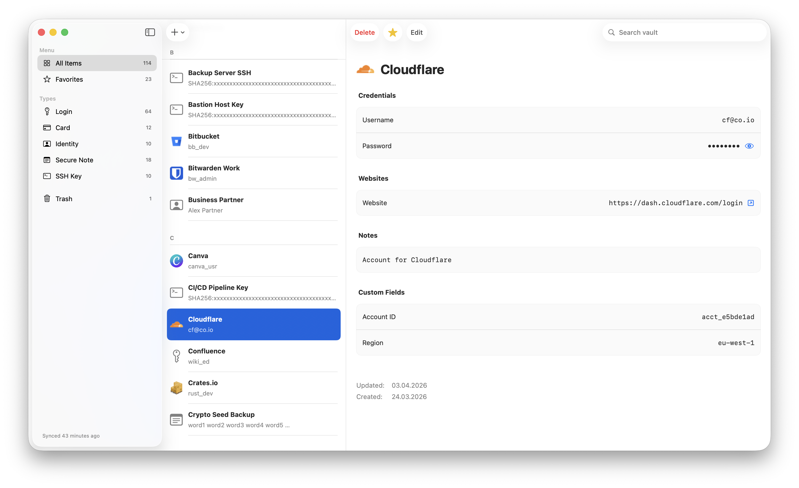

<div align="center">

# Prizm

[](https://github.com/b0x42/prizm/actions/workflows/ci.yml)
[](https://swift.org/)
[](https://www.apple.com/macos/)
[](LICENSE)

Native macOS client for Vaultwarden and self-hosted Bitwarden, built in Swift.

*Your secrets. Your server. Our user interface.*

</div>

---



---

## Why Prizm

The official Bitwarden desktop app is built with Electron — a Chromium-based web wrapper. It works, but it doesn't feel like a Mac app.

Prizm fills that gap: a fully native macOS client, built in SwiftUI, that connects to the same self-hosted Vaultwarden or Bitwarden server you already run. It looks and behaves like a real Mac app because it is one.

If you self-host your passwords and care about software quality on your own machine, Prizm is for you.

### Mission & Principles

Prizm exists to give macOS users a native, auditable, trustworthy interface to their self-hosted password vault.

**Native-first.** SwiftUI only. No Electron, no web views, no compromise on the Mac experience.

**Security-first.** No hand-rolled crypto. Every algorithm is a vetted standard with a public specification. Every security decision is documented so you can verify it.

**Radical transparency.** This is security software. You should be able to read the code, understand the cryptography, and decide whether to trust it. That's why it's open source and why the security documentation is thorough.

**Simple and honest.** Build what's needed. Say what's not supported. No dark patterns, no growth hacks, no telemetry.

## Features

- **Full vault management** — browse, create, edit, delete, and restore all item types (logins, cards, identities, secure notes, SSH keys) with Trash and favourites support
- **Folder organization** — create, rename, and delete folders; nested subfolders via `/` naming convention with collapsible tree view; drag-and-drop items onto folders; folder-scoped search
- **Built for power users** — ⌘F global search with match highlighting, ⌘N new item, ⌘L lock, one-keystroke copy for username / password / website, Option to reveal masked fields. [Full shortcut list](#shortcuts)
- **File attachments** — upload, download, open, and delete encrypted file attachments on any vault item; drag-and-drop batch upload; two-layer AES-256-CBC + HMAC-SHA256 encryption with per-attachment keys
- **Password & passphrase generator** — configurable length, character sets, and word separators
- **Auto-lock** — locks on sleep and screensaver; sync status always visible in the sidebar

## Install

### Requirements

- macOS 26 or later
- A self-hosted [Vaultwarden](https://github.com/dani-garcia/vaultwarden) or [Bitwarden](https://bitwarden.com/) server

Tested against Vaultwarden 1.35.4. Older versions may work but are not validated.

### Unsigned DMG (simplest)

A signed, notarized DMG requires an Apple Developer ID certificate ($99/year). This project is a solo open-source effort — that cost is not justified for early releases. Until that changes, the DMG is unsigned.

**How to open an unsigned app on macOS:**

After downloading, right-click (Control-click) the `.app` and choose **Open**, then confirm. You only need to do this once. After that, you can open it normally.

Alternatively, from Terminal:

```bash
xattr -dr com.apple.quarantine /Applications/Prizm.app
```

**[Download Prizm v1.0.0](https://github.com/b0x42/prizm/releases/tag/v1.0.0)**

### Build from source

```bash
git clone https://github.com/b0x42/prizm.git
cd prizm
cp Prizm/LocalConfig.xcconfig.template Prizm/LocalConfig.xcconfig
# Fill in your Apple Team ID in LocalConfig.xcconfig, then:
open "Prizm/Prizm.xcodeproj"
```

See [DEVELOPMENT.md](DEVELOPMENT.md) for full setup instructions, including how to get a free Team ID.

## Privacy & Security

Prizm collects nothing. No telemetry, no analytics, no crash reporting, no usage data. There is no Prizm server — the app talks exclusively to your Vaultwarden or Bitwarden instance. Nothing leaves your server.

All cryptography runs locally on your device:

- **Argon2id key derivation** (RFC 9106, memory-hard) — makes offline brute-force attacks computationally infeasible
- **AES-256-CBC + HMAC-SHA256** authenticated encryption — all vault data stays encrypted in memory and in transit
- **macOS Keychain** storage (device-only, `WhenUnlockedThisDeviceOnly`) — session keys never touch iCloud

The app is open source. Verify these claims by reading the code. See [SECURITY.md](SECURITY.md) for the full threat model, algorithm specifications, and what the app does not protect against.

## Shortcuts

| Shortcut | Action |
|---|---|
| ⌘F | Global search |
| ⌘N | New item |
| ⌘L | Lock vault |
| ⌘E | Edit selected item |
| ⌘S | Save edits |
| ⇧⌘C | Copy username |
| ⌥⌘C | Copy password |
| ⌥⇧⌘C | Copy website |
| ⇧⌘Q | Sign out |
| ⌥ (hold) | Reveal masked fields |

Any shortcut can be remapped in **System Settings → Keyboard → Keyboard Shortcuts → App Shortcuts**. Add a rule for Prizm with the exact menu item name and your preferred key combination.

## Roadmap

| Now | Next | Later |
|---|---|---|
| Reorder sidebar sections | Organisation vault support | Passkey support |
| Face ID / Touch ID unlock | Multiple accounts | Browser auto-fill extension |
| TOTP / 2FA copy | Watchtower / breach check | Full support for KDBX 4 (KeePass) |
| Background sync | | |

**Now** — actively in development. **Next** — planned for the following 3–6 months. **Later** — on the list with no fixed timeline.

Want to shift something up the list? [Open an issue](https://github.com/b0x42/prizm/issues) — priorities are driven by user feedback.

## Known Limitations

- **Personal vault only** — Organisation ciphers are skipped during sync.
- **No browser auto-fill** — There is no browser extension. Copy-paste is the current workflow.
- **No biometric unlock** — Touch ID / Face ID unlock is not yet implemented.
- **macOS 26 required** — The app uses SwiftUI features only available in macOS 26.
- **Passkeys not supported** — SSH key items are viewable but passkey-based login is not implemented.
- **No offline vault creation** — Creating or editing items requires an active server connection.
- **Attachment size limit** — Files larger than 500 MB are rejected. Bitwarden-hosted servers require a premium subscription for attachments; Vaultwarden is unaffected.

## Contributing

See [DEVELOPMENT.md](DEVELOPMENT.md) for prerequisites, build instructions, and the architecture overview.

Changes follow an **openspec** workflow: each feature lives in `openspec/changes/<name>/` with a proposal, design, and task list before any code is written. See `openspec/` for active and archived changes.

Pull requests welcome. Please open an issue first for anything significant.

---

*Not affiliated with Bitwarden, Inc., 8bit Solutions LLC, or the Vaultwarden project.*
